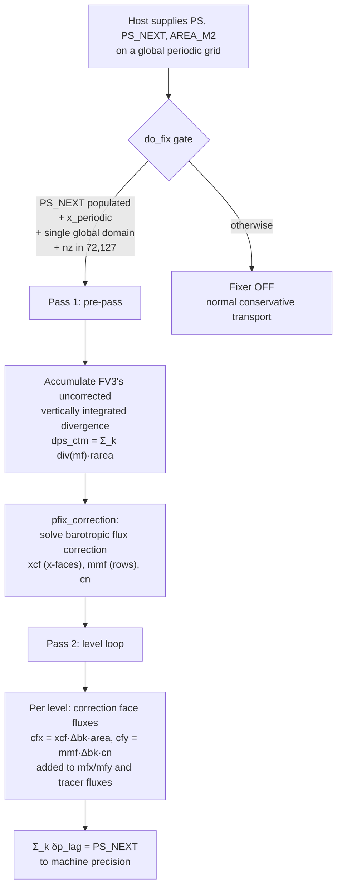
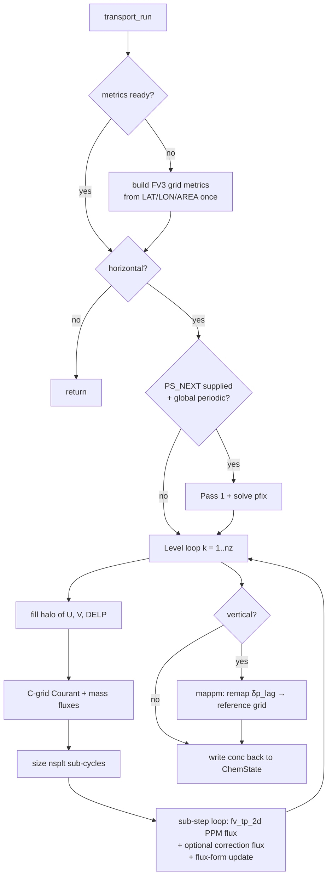

# Transport Process

**Process Type:** Transport
**Description:** FV3 flux-form finite-volume advection with vertical Lagrangian PPM remap
**Author:** CATChem Development Team
**Version:** 1.0

## Overview

The Transport process moves tracers **horizontally and vertically** on the model
grid using the **finite-volume flux-form advection** of the GFDL **FV3**
dynamical core. The numerical kernels (`fv_tp_2d`, the PPM reconstruction, and
the `mappm` vertical remap) are **vendored verbatim** from the
[GFDL FV3 cubed-sphere core](https://github.com/NOAA-GFDL/GFDL_atmos_cubed_sphere)
— the same routines UFS-ATM and GCHP use — so CATChem inherits their proven,
mass-conserving numerics unchanged.

Unlike the column processes (settling, dry deposition, chemistry), transport is
**inherently grid-coupled**: updating one cell requires its horizontal
neighbours. The process therefore owns everything on the model-grid side of the
seam: it pulls winds and layer thickness from `MetState`, tracers from
`ChemState`, builds the FV3 grid metrics, fills the ghost-cell **halo**, sizes
the Courant sub-cycling, and applies the flux-form update.

## Available Schemes

Transport is not scheme-selectable in the emission/chemistry sense; instead it
composes three FV3 building blocks, each toggled from configuration:

- **Horizontal advection** (`horizontal: true`) — FV3 flux-form finite-volume
  advection (`fv_tp_2d`) with a **Piecewise Parabolic Method (PPM)** subgrid
  reconstruction. The PPM variant is selected by `hord` (8 = monotone, the FV3
  tracer default).
- **Vertical transport** (`vertical: true`) — the FV3 **vertically-Lagrangian
  PPM remap** (`mappm`). The horizontally-deformed layers are remapped back to
  the reference hybrid-sigma grid. There is **no separate vertical-velocity
  (OMEGA) advection**; vertical motion is implied by horizontal mass
  convergence. Selected by `vord` (8 = monotone).
- **Pressure fixer** (automatic) — the **PJC/LLNL barotropic pressure fixer**
  (`fv3_pfix`). When the host supplies the end-of-step surface pressure
  (`PS_NEXT`) on a global periodic grid, a mass-flux correction forces the
  advected (Lagrangian) surface pressure to close exactly onto `PS_NEXT`. See
  [The pressure fixer](#7-the-pressure-fixer-optional).

### Physical Features

- **Mass conservation** to machine precision (flux form: what leaves one cell
  enters its neighbour).
- **Monotonicity** — `hord = 8` / `vord = 8` are monotone (no new extrema),
  which is required for positive-definite tracers.
- **Courant sub-cycling** — each level is automatically split into `nsplt`
  sub-steps so the effective CFL stays below 1.
- **Grid-agnostic metrics** — corner-based great-circle areas and edge lengths
  make the operator valid on rectilinear, curvilinear, and cubed-sphere grids.

## Configuration

All keys live under `processes/transport/` and are **optional** (sensible
defaults are applied when absent).

### YAML Configuration Example

```yaml
processes:
  transport:
    activate: true       # master on/off switch for the process
    horizontal: true     # run horizontal (lon-lat) flux-form advection
    vertical: true       # run the vertical Lagrangian PPM remap (mappm)
    hord: 8              # FV3 PPM id for HORIZONTAL advection (8 = monotone)
    vord: 8              # FV3 PPM id (mappm kord) for the VERTICAL remap
    halo_width: 3        # ghost-cell ring width (must be >= 3 for PPM)
    x_periodic: true     # wrap the west/east (longitude) halo — REQUIRED for a
                         #   global longitude grid (and for the pressure fixer)
    y_periodic: false    # south/north (latitude) closure — almost always false
```

| Key | Type | Default | Description |
|-----|------|---------|-------------|
| `activate`   | logical | `true`  | Enable/disable the whole process. |
| `horizontal` | logical | `true`  | Run horizontal advection. |
| `vertical`   | logical | `false` | Run the vertical Lagrangian PPM remap (requires `horizontal`). Only active for level counts with a built-in hybrid table (`nz = 72` or `127`); otherwise skipped. |
| `hord`       | integer | `8`     | FV3 PPM id for horizontal advection. `7,8,9,10` = monotone (use for tracers); `5,6` = linear, less diffusive but can overshoot. |
| `vord`       | integer | `8`     | FV3 PPM id (`mappm` kord) for the vertical remap. |
| `halo_width` | integer | `3`     | Ghost-cell ring width of the data domain. Must be `>= 3` for the PPM stencil. |
| `x_periodic` | logical | `false` | `true` wraps the 0/360 seam (global longitude grid); `false` = zero-gradient replication (regional grid). |
| `y_periodic` | logical | `false` | Latitude closure. Almost always `false` (poles are not periodic). |

### Required Meteorological Fields

The process advertises three required fields (see `get_required_met_fields`):

- **`U`** — grid-relative zonal wind at cell centres (A-grid) [m s⁻¹]
- **`V`** — grid-relative meridional wind at cell centres (A-grid) [m s⁻¹]
- **`DELP`** — layer pressure thickness [Pa]

Optional fields that **enable the pressure fixer** when populated by the host:

- **`PS`** — surface pressure at the current time [Pa]
- **`PS_NEXT`** — surface pressure at the **next** model step, `PS(t+Δt)` [Pa]
- **`AREA_M2`** — true cell area [m²]
- **`LAT`, `LON`** — cell-centre latitude/longitude [degrees], used once to build
  the FV3 grid metrics.

## How Transport Works

This section walks through **one transport step** in detail, with figures for
the halo layout, the C-grid staggering, the PPM reconstruction, the vertical
remap, and the pressure fixer.

### 1. Domains and the halo (ghost-cell) ring

FV3's flux operator needs a few neighbours **beyond** the cells CATChem owns.
CATChem carries its fields only on the **compute domain** `(is:ie, js:je)`; the
operator works on a larger **data domain** `(isd:ied, jsd:jed)` that extends the
compute domain by `ng` ghost cells on every side (`ng = halo_width`, default 3).
Before each step the ghost ring is filled by `TransportHalo`.

```text
 jed +-------------------------------------------------+
     |                 NORTH ghost ring                |   ng rows
     |      +-----------------------------------+      |
 je  |  W   |                                   |  E   |
     |  e   |          COMPUTE  DOMAIN          |  a   |
     |  s   |           (is:ie, js:je)          |  s   |
     |  t   |     the cells CATChem actually    |  t   |
     |      |             owns/updates          |      |
 js  |  g   |                                   |  g   |
     |      +-----------------------------------+      |
     |                 SOUTH ghost ring                |   ng rows
 jsd +-------------------------------------------------+
    isd     is                               ie      ied
     <-ng->                                   <-ng->
```

**Two boundary conditions** are supported per axis:

- `x_periodic: true` / `y_periodic: true` → **periodic wrap** (for a globally
  periodic axis such as the longitude of a global lat-lon grid).
- otherwise → **zero-gradient replication** (regional boundary / safe default).

For the periodic longitude axis, the west and east ghost cells are copies of the
opposite interior edge, so a tracer leaving the east edge re-enters at the west:

```text
        isd       is                         ie       ied
         |         |                          |         |
   ...  g  g  g  |  C  C  C   ...   C  C  C  |  g  g  g  ...
        \_____/                               \_____/
       west ghost                            east ghost
   filled from EAST interior             filled from WEST interior

   periodic fill:   arr(is-h, j) = arr(ie-h+1, j)   (wrap from east)
                    arr(ie+h, j) = arr(is+h-1, j)   (wrap from west)
```

X-halos are filled first over the interior rows, then Y-halos over the full
column range (including the freshly-filled x-halos), so the four **corners** are
populated correctly.

!!! note "Distributed / parallel backend"
    In the current build each PET holds one local tile and the fill is done
    in-process (serial / single-tile). When an off-PET decomposition handle
    (ESMF `ESMF_FieldHalo` RouteHandle or an MPI Cartesian communicator) becomes
    reachable, it plugs into `halo_update`: the exchange runs first, then the
    same periodic/replicate closure is applied at the true domain edges. Callers
    do not change.

### 2. Winds → C-grid Courant numbers and mass fluxes

FV3 is a **C-grid** scheme: the fluxes are carried on cell **faces**, but
CATChem stores winds at cell **centres** (A-grid). Each level therefore
re-staggers the A-grid winds `(ua, va)` to face-normal Courant numbers
`crx` (x-faces) and `cry` (y-faces), and forms the face mass fluxes
`xfx, yfx` (and `mfx, mfy`):

```text
                north face (cry, yfx)
              +-----------────-----------+
              |                          |
  west face   |            o             |   east face
 (crx, xfx) --|         ua, va           |-- (crx, xfx)
              |         (A-grid,         |
              |        cell centre)      |
              +-----------────-----------+
                south face (cry, yfx)

   crx(i,j) ~ (u at face) * dt / dx     (dimensionless Courant number)
   xfx(i,j) = crx(i,j) * face_length    (volume flux through the face)
   mfx(i,j) = xfx(i,j) * delp_face      (mass flux through the face)
```

The **maximum Courant number** over the level sets the sub-cycle count
`nsplt = int(1 + cmax)`; the mass fluxes are then scaled by `1/nsplt` so each
sub-step is CFL-stable (see [step 5](#5-courant-sub-cycling)).

### 3. PPM subgrid reconstruction

Inside each cell PPM fits a **parabola** to the cell-mean values, so the tracer
is no longer a staircase of constants but a smooth, conservative profile. This
is what makes the scheme high-order and low-diffusion.

```text
  cell means (input)            PPM reconstruction (per cell i)
  q_{i-1}  q_i   q_{i+1}
                                        aR_i
   ┌──┐               ┌──┐         aL_i  ╱‾‾‾‾‾‾╲
   │  │   ┌──────┐    │  │           o──╱        ╲──o
   │  │   │  q_i │    │  │            ╲╱  parabola  ╲
 ──┘  └───┘      └────┘  └──        ── a(x), x ∈ [0,1] ──
      i-1     i      i+1                  cell i
```

**Cell-edge values** use the 4-point volume-mean interpolation

```text
    q(i+1/2) = (7/12)*( q_i + q_{i+1} ) - (1/12)*( q_{i-1} + q_{i+2} )
```

which defines the left/right edge values `aL = q(i-1/2)` and `aR = q(i+1/2)`
of cell `i`. The subgrid profile is

```text
    a(x) = aL + x*[ (aR - aL) + a6*(1 - x) ],   for x in [0, 1]
    a6   = 3*( 2*q_i - (aL + aR) )
```

where `a6` is the "mean-preserving" curvature term. A **monotonicity
limiter** (selected by `hord`/`vord = 8`) then clips `aL, aR` so the
parabola introduces **no new extrema** — essential for keeping tracer mixing
ratios positive.

**Flux across a face** is the integral of `a(x)` over the **upwind departure
region** — the slab of width `|CFL|` that crosses the face during one step
`dt` (a semi-Lagrangian PPM flux):

```text
       upwind cell i           face i+1/2      downwind cell i+1
   ┌─────────────────────────────┐│
   │                    ░░░░░░░░░░││   flux = ∫ a(x) dx over the
   │        a(x)        ░ shaded ░││          shaded departure slab
   │                    ░ region ░││          of width |CFL|
   └─────────────────────────────┘│
                        <--|CFL|-->
                (wind blows left → right)
```

Because the same parabola supplies the flux that **leaves** cell `i` and
**enters** cell `i+1`, mass is conserved exactly.

### 4. Flux-form finite-volume update

With the face fluxes in hand, every advected species is updated by the FV3
**flux-form** relation. Per level, per sub-step:

```text
               q^n * dp1 + ( fx - fx(i+1) + fy - fy(j+1) ) / A
    q^{n+1} =  ----------------------------------------------
                                   dp2

    dp2     =  dp1 + ( mfx - mfx(i+1) + mfy - mfy(j+1) ) / A
```

where `fx, fy` are the PPM tracer fluxes, `mfx, mfy` the mass fluxes,
`1/A = rarea` the inverse cell area, `dp1` the incoming layer thickness and
`dp2` the **Lagrangian** thickness after horizontal convergence. The numerator
conserves tracer mass; the denominator tracks how the layer thickened or
thinned.

### 5. Courant sub-cycling

If the flow crosses more than one cell per step (CFL > 1), a single flux-form
update would be unstable. Transport splits the level into
`nsplt = floor(1 + cmax)` sub-steps and scales the mass fluxes by `1/nsplt`,
so each sub-step moves less than one cell. Because the update is linear in the
(per-sub-step) mass flux, all species reach the same evolved `dp2` after
`nsplt` sub-steps — this shared Lagrangian thickness is what the vertical remap
consumes.

### 6. Vertical Lagrangian remap

Horizontal convergence deforms the layers: after step 4 the column no longer
sits on the reference hybrid-sigma grid (`sum_k δp2 ≠ PS_reference`). The FV3
**vertically-Lagrangian** approach handles vertical transport *implicitly*:

```text
  reference grid        Lagrangian layers        remapped back
  (before)              (after horizontal          (mappm →
                         convergence)               reference grid)
  ─── p0 ───            ─── p0 ───                 ─── p0 ───
     δp                    δp'  (thicker)             δp
  ─── p1 ───            ─── p1'──                  ─── p1 ───
     δp        ==>         δp'  (thinner)   ==>        δp
  ─── p2 ───            ─── p2'──                  ─── p2 ───
     δp                    δp'                        δp
  ─── p3 ───            ─── p3'──                  ─── p3 ───
```

`mappm` performs a **conservative 1-D PPM remap** of each tracer from the
deformed layer thicknesses `dp2` back onto the reference grid,
controlled by `vord`. This is exactly the routine UFS-ATM and GCHP use. No
vertical velocity is needed — the vertical flux is encoded in the layer
deformation produced by the horizontal solver.

### 7. The pressure fixer (optional)

Winds and `dp` that come from **interpolated/regridded** meteorology do
not perfectly satisfy continuity, so FV3's vertically integrated mass divergence
will not exactly equal the host's true surface-pressure tendency. Left alone,
this mismatch shows up as spurious redistribution during the vertical remap. The
**PJC/LLNL pressure fixer** removes it by adding a small **barotropic** mass-flux
correction so the advected surface pressure closes onto `PS_NEXT`.

It runs as a **two-pass** algorithm:



**Pass 1 (pre-pass).** Loop over all levels, build the same mass fluxes the real
advection will use, and accumulate FV3's *uncorrected* vertically integrated
divergence:

```text
    dps_ctm(i,j) = sum_k ( mfx - mfx(i+1) + mfy - mfy(j+1) ) / A
```

**Solve.** `pfix_correction` finds a single-layer (barotropic) flux correction —
`xcf` on x-faces, `mmf` per latitude row, and a scalar `cn` — whose divergence
supplies the difference between `dps_ctm` and the target `(PS_NEXT - PS)`.

**Pass 2 (level loop).** The barotropic correction is distributed onto each
hybrid layer in proportion to its `dbk = b_k - b_{k+1}` weight:

```text
    cfx(i,j,k) = xcf(i,j) * dbk * A(i,j) / nsplt
    cfy(i,j,k) = mmf(j)   * dbk * cn     / nsplt
```

These correction fluxes are **added to both the mass fluxes and the tracer
fluxes**, so the tracer stays consistent with the corrected air mass. Summed
over levels, `sum_k dp_lag = PS_NEXT` to machine precision.

!!! important "There is no on/off switch for the fixer"
    The fixer is **decided automatically** in `transport_run`. It engages only
    when **all** of the following hold in a given step: the host has populated
    `PS_NEXT` this step (`is_field_set('PS_NEXT')`); `PS_NEXT`, `PS`, and
    `AREA_M2` are allocated with matching dimensions; `x_periodic: true`; the
    domain is a single undecomposed global grid (`is == 1 .and. js == 1`); and
    `nz ∈ {72, 127}` (a hybrid Ap/Bp table exists). Otherwise transport runs its
    normal conservative path with the fixer off. This mirrors the UFS-ATM/GCHP
    convention, where the fixer is driven by the host's mass coupling rather than
    a user flag.

### Algorithm summary



## Usage

### Initialization

```fortran
use ProcessInterface_Mod, only : ProcessInterface
use TransportProcessCreator_Mod, only : register_transport_process
use ProcessManager_Mod, only : ProcessManagerType

type(ProcessManagerType), pointer :: process_mgr
integer :: rc

! Register the transport factory with the process manager, then add it
call register_transport_process(process_mgr, rc)
call core%add_process('transport', rc)   ! init() is called here
```

### Running the Process

```fortran
! Advance one model step (transport reads dt from the shared TimeState)
call core%run_timestep(timestep_index, dt, rc)
```

### Finalization

```fortran
call core%finalize(rc)
```

### Full Fortran Example

Register the transport factory, add the process, then advance the model. The
transport process reads its timestep from the shared `TimeState`, so the host
only supplies the step index and `dt` to `run_timestep`.

```fortran
use CATChemCore_Mod,             only : CATChemBuilderType, CATChemCoreType
use ProcessManager_Mod,          only : ProcessManagerType
use TransportProcessCreator_Mod, only : register_transport_process
use error_mod,                   only : CC_SUCCESS

type(CATChemBuilderType)          :: builder
type(CATChemCoreType)             :: core
type(ProcessManagerType), pointer :: process_mgr
integer                           :: rc, n

! 1. Build the core from a configuration file and grid dimensions
builder = builder%init()
builder = builder%with_name('my_run')
builder = builder%with_config('./CATChem_config.yml')
builder = builder%with_grid(nx, ny, nz)
call builder%build(core, rc)

! 2. Register + add the transport process (init() runs inside add_process)
process_mgr => core%get_process_manager()
call register_transport_process(process_mgr, rc)
call core%add_process('transport', rc)

! 3. Advance the model; transport advects every ChemState species each step
do n = 1, nsteps
   call core%run_timestep(n, dt, rc)
   if (rc /= CC_SUCCESS) stop 'transport step failed'
end do

! 4. Finalize
call core%finalize(rc)
```

### Regional Configuration

For a regional (non-global) grid, disable the periodic longitude wrap so the
halo uses zero-gradient replication at the domain edges. The pressure fixer does
not engage on a regional grid.

```yaml
processes:
  transport:
    activate: true
    horizontal: true
    vertical: false      # skip vertical remap unless nz has a hybrid table
    hord: 8
    vord: 8
    halo_width: 3
    x_periodic: false    # regional east/west boundary → replicate
    y_periodic: false
```

### Enabling the Pressure Fixer

The PJC/LLNL pressure fixer has **no configuration switch** — it engages
automatically when the host supplies the end-of-step surface pressure on a
global periodic grid. To turn it on, populate `PS`, `PS_NEXT`, and `AREA_M2` in
`MetState` and mark `PS_NEXT` as set each step:

```fortran
use StateManager_Mod, only : StateManagerType
use MetState_Mod,     only : MetStateType

type(StateManagerType), pointer :: state_mgr
type(MetStateType),     pointer :: met

state_mgr => core%get_state_manager()
met       => state_mgr%get_met_state_ptr()

! Surface pressure at the next model step, PS(t+dt)  [Pa]
if (.not. allocated(met%PS_NEXT)) allocate(met%PS_NEXT(nx, ny))
met%PS_NEXT(:,:) = ps_next_field      ! from the host's mass coupling
call met%mark_field_set('PS_NEXT')    ! required each step the target is valid
```

The fixer then forces the advected surface pressure to close onto `PS_NEXT` to
machine precision. See [The pressure fixer](#7-the-pressure-fixer-optional) for
the full gating conditions.

## Diagnostics

Transport currently exposes no dedicated diagnostic collections; its observable
effect is the **updated tracer field** (`ChemState%ChemSpecies(:)%conc`). Mass
conservation and (with the fixer) surface-pressure closure are verified by the
tests below. Diagnostic hooks can be added following the pattern used by the
column processes.

## Process Structure

```
src/process/transport/
├── ProcessTransportInterface_Mod.F90   # Main process interface
├── TransportProcessCreator_Mod.F90     # Process factory / registration
├── TransportHalo_Mod.F90               # Ghost-cell halo seam (periodic/replicate)
├── TransportGridMetrics_Mod.F90        # FV3 grid metrics from MetState geometry
├── TransportMassFlux_Mod.F90           # C-grid mass flux, Courant, sub-cycling
├── CMakeLists.txt                      # Build configuration (-fdefault-real-8)
└── kernels/                            # Vendored FV3 numerics
    ├── fv3_tp_core_mod.F90             # fv_tp_2d + PPM (xppm/yppm)
    ├── fv3_vremap_mod.F90              # mappm vertical PPM remap
    ├── fv3_pfix_mod.F90               # PJC/LLNL barotropic pressure fixer
    └── fv3_grid_types_mod.F90          # Trimmed FV3 grid derived types
```

!!! note "Precision seam"
    The transport numerics library (`CATChem_process_transport`) is compiled with
    `-fdefault-real-8 -fdefault-double-8`, matching the upstream FV3
    default-real-8 build, so every bare `real` work array is REAL(8). CATChem
    state (`conc`, `U`/`V`/`DELP`) is `real(fp)`. The conversion happens **only at
    the seam** where state is copied into/out of the data-domain work arrays; the
    vendored kernels themselves are untouched.

## Testing

- `tests/process/transport/unit/` — unit tests of the kernels (constancy,
  conservation, boundedness, vertical remap, and the pressure-fixer kernel at
  machine precision).
- `tests/process/transport/integration/` — end-to-end test driving transport
  through `CATChemCore` with the pressure fixer **off** (mass conservation of a
  non-uniform tracer under non-divergent flow) and **on** (a uniform field stays
  uniform under a structured `PS_NEXT` target).

The integration test
(`tests/process/transport/integration/test_transport_integration.F90`) exercises
both paths through `CATChemCore`:

- **Fixer OFF** — a non-uniform (zonal-cosine) tracer is advected under a
  non-divergent flow; the test asserts **mass conservation**, boundedness, and
  finiteness.
- **Fixer ON** — a **uniform** tracer field is advected with a structured
  `PS_NEXT` target; the test asserts the field **stays uniform** (constancy) to
  tolerance.

Run it via CTest:

```bash
ctest -R transport_integration --output-on-failure
```

or build and run the standalone target:

```bash
cmake --build build --target run_transport_integration
```

## Contributing

When modifying or extending this process:

1. **Kernel updates:** re-download the FV3 source and re-apply only the small,
   documented header edits (module renames, FMS-dependency removal). The kernel
   bodies must stay identical to upstream.
2. **Interface changes:** update `ProcessTransportInterface_Mod.F90`.
3. **Halo / parallel backend:** extend `TransportHalo_Mod.F90` (the off-PET
   exchange plugs into `halo_update`).
4. **Tests:** add corresponding unit and integration tests.
5. **Documentation:** update this file.

## References

- Lin, S.-J. (2004). *A vertically Lagrangian finite-volume dynamical core for
  global models.* Monthly Weather Review, 132, 2293–2307.
- Lin, S.-J., & Rood, R. B. (1996). *Multidimensional flux-form semi-Lagrangian
  transport schemes.* Monthly Weather Review, 124, 2046–2070.
- Putman, W. M., & Lin, S.-J. (2007). *Finite-volume transport on various
  cubed-sphere grids.* Journal of Computational Physics, 227, 55–78.
- Colella, P., & Woodward, P. R. (1984). *The Piecewise Parabolic Method (PPM)
  for gas-dynamical simulations.* Journal of Computational Physics, 54, 174–201.
- GFDL FV3 cubed-sphere dynamical core:
  <https://github.com/NOAA-GFDL/GFDL_atmos_cubed_sphere>
- GEOS-Chem pressure fixer (`pjc_pfix`), P. Cameron-Smith (LLNL).
